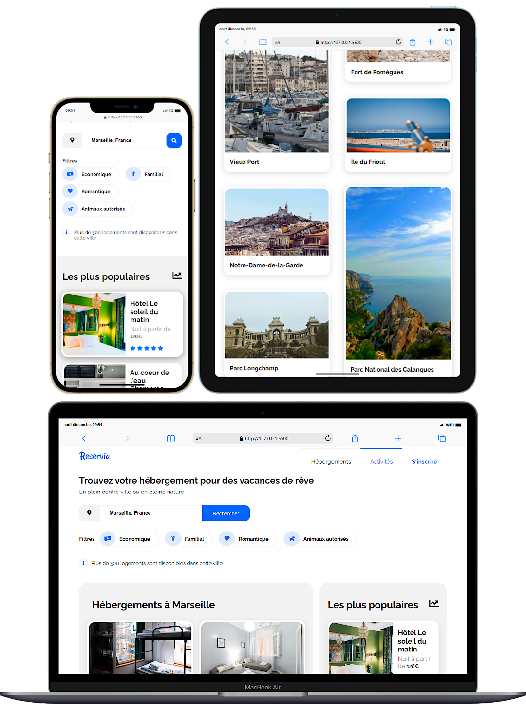

# OpenClassrooms Projet 02 

## Transformez une maquette en site web :

## Éléments fournis par l'organisme de formation.
- La maquette pour les résolutions ordinateur et téléphone nous est donné.
- Toutes les images présentes sur le site sont aussi livrés en format sm, md, l & xl.
- Les icones proviennent de [Font Awesome](https://fontawesome.com/)
- La police est ["Raleway"](https://fonts.google.com/specimen/Raleway)

## Cahier des charges
- L'integration doit se faire en HTML5 & CSS3, sans framework.
- Le champ de recherche doit être un champ de saisie, dont le texte peut être édité. La fonctionnalité de recherche ne doit pas être implémenté pour autant.
- Chaque carte d’hébergement ou d’activité devra être cliquable dans son intégralité. Pour l’instant les liens seront vides.
- Les filtres, bien que non fonctionnels, doivent changer de style au survol.
- Dans le menu, les liens “Hébergements” et “Activités” sont des ancres qui doivent mener aux sections de la page.
- Même si aucune maquette pour la résolution tablette n'est fournis, l'intégration doit la prendre en charge.
- Les images doivent être de taille adéquate afin qu'elle soit le plus jolie possible en impactant le moins possible le temps de chargement de la page.
- Le code devra utiliser les balises sémantiques et ne doit contenir aucune erreur ni alerte au validateur W3C HTML et CSS.
- Le site devra être compatible avec les dernières versions de Chrome et Firefox.
- Le HTML et le CSS doivent être séparés et le dossier doit être organisé
- Le code doit être versionné avec git et doit avoir un repo distant sur Github ou Gitlab

## Notes sur la réalisation du projet
- L'integration est faite sur l'éditeur Visual Studio Code 
- [Sass](https://sass-lang.com/) est utilisé pour organiser le css.
- Une partie JS est présente pour le système d'onglet, et certaine animation CSS en plus, dans une but pédagogique uniquement. Ils serront désactivé pour le rendu du projet afin de respecter les consignes. 

## À FAIRE :

- ✅ <del>Correction des grid</del>
- ❌ Minimisé les lignes inutiles. 
- ❌ Refont complete a faire  
- ✅ <del>Revoir tous le layout probablement. certainement une meilleures facon de faire</del>
- ✅ <del>Re verif les W3C a la fin</del>
- ✅ <del> Remplir les alt </del> 
- ✅ <del> Add grand pix au click. Convertion du small / large. </del>
- ✅ <del> Correction erreur importante w3c css / html </del>
- ✅ <del> Correction erreur low w3c css / html  </del>
-
- ❌ Imcohérence sur maquette (mise en forme prix / centrage footer ? ce renseigner)
